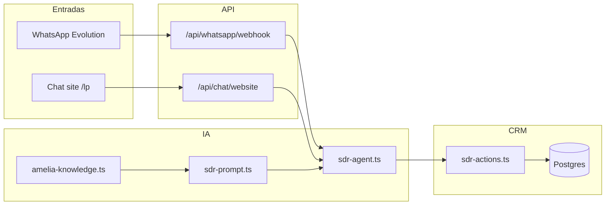
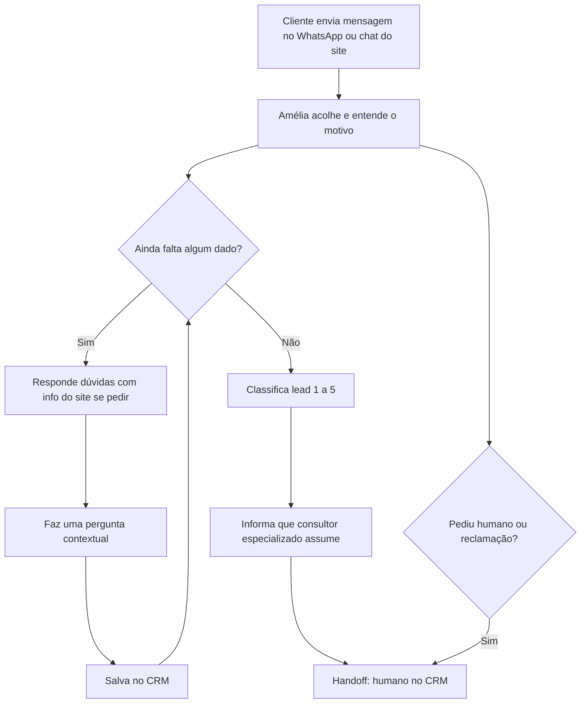

# Design: Agente SDR inteligente + documentação para cliente final

**Data:** 2026-05-22  
**Status:** Aprovado pelo usuário em 2026-05-22  
**Escopo:** Evoluir a Amélia SDR (WhatsApp + chat do site) para conversa mais humana e consultiva, usando conhecimento da landing page, sem fechar vendas; trocar modelo IA; entregar fluxograma para cliente/comercial.

---

## Objetivo

O agente atual (`lib/ai/sdr-prompt.ts`) segue um roteiro rígido de 6 perguntas em ordem fixa, proíbe falar sobre planos/benefícios (contradiz a UI do admin) e soa como formulário. O objetivo é:

1. **Qualificar** mantendo as 6 informações essenciais, mas em **ordem flexível** conforme a conversa.
2. **Contextualizar** com conteúdo real da landing (`/lp`): benefícios, operadoras, FAQ, prova social — **sem** valores personalizados nem proposta fechada.
3. Aplicar **técnicas de venda consultiva** (escuta ativa, SPIN natural, prova social, educação) com tom de **consultora acolhedora**.
4. Usar modelo **`moonshotai/kimi-k2.6`** via OpenRouter.
5. Publicar **documentação para o cliente final**: página no site + DOCX/PDF (gerador python-docx).

---

## Decisões de produto (confirmadas)

| Tema | Decisão |
|------|---------|
| Escopo comercial | **A** — Educar com base na LP; qualificar; consultor humano para proposta/preço fechado |
| Tom | **A** — Consultora acolhedora; empatia antes do script |
| Ordem das perguntas | **A** — 6 dados obrigatórios; ordem livre |
| Entrega documentação | **D** — Site (`/como-funciona`) + DOCX/PDF para vendas |
| Abordagem técnica | **Opção 1** — `amelia-knowledge.ts` + refactor do prompt (não CMS, não prompt monolítico) |
| Modelo IA | **`moonshotai/kimi-k2.6`** (OpenRouter) |

---

## Arquitetura

### Diagrama



### O que permanece igual

- Pipeline: `processSDRMessage` → `generateObject` (Zod: `reply` + `actions[]`)
- Ações CRM: `qualify`, `update_stage`, `score_lead`, `handoff`, `schedule_followup`
- Handoff desliga `aiEnabled` e move deal para proposta
- Scoring 1–5 ao completar checklist
- Webhook sync + IA em `after()` (conforme spec de ingestão 2026-05-21)

### Arquivos novos

| Arquivo | Responsabilidade |
|---------|------------------|
| `lib/ai/amelia-knowledge.ts` | Fonte única de copy permitido (benefícios, operadoras, FAQ, contatos, limites) |
| `docs/gerar_fluxo_cliente.py` | Gera DOCX voltado ao cliente/comercial (fluxograma simples) |
| `app/como-funciona/page.tsx` | Página pública com o mesmo fluxo (Mermaid + texto) |

### Arquivos alterados

| Arquivo | Mudança |
|---------|---------|
| `lib/ai/sdr-prompt.ts` | Checklist flexível, técnicas consultivas, injeção de KB, remover proibição absoluta de falar de planos |
| `lib/ai/sdr-agent.ts` | `SDR_MODEL = 'moonshotai/kimi-k2.6'`, timeout 35s, `maxOutputTokens` 600 (ajustável após teste) |
| `app/api/whatsapp/diagnostics/route.ts` | Exibir modelo Kimi K2.6 |
| `app/admin/cms/crm/settings/page.tsx` | Alinhar texto “Comportamento do Agente” com spec |
| `components/layout/Footer.tsx` | Link “Como funciona a Amélia” → `/como-funciona` |
| `docs/gerar_fluxo_agente.py` | Atualizar referência de modelo (doc técnico) |

### Modelo OpenRouter: `moonshotai/kimi-k2.6`

| Parâmetro | Valor | Motivo |
|-----------|-------|--------|
| ID | `moonshotai/kimi-k2.6` | Solicitação do usuário; melhor nuance conversacional |
| Provedor | OpenRouter + `@ai-sdk/openai` | Sem mudança de integração |
| Timeout | **35s** (era 20s) | Modelo mais lento que Flash Lite |
| `maxOutputTokens` | **600** | Margem para JSON + reply natural |
| `temperature` | **0.7** | Manter |
| Validação | Teste em staging com `test-agent` e mensagem real | Confirmar JSON estável com `generateObject` |

**Risco:** custo por token maior que `gemini-3.1-flash-lite`; monitorar dashboard OpenRouter.

**Mitigação:** se JSON instável, reduzir temperature para 0.5 ou adicionar `repair` no catch (fora do escopo inicial; só se teste falhar).

---

## Base de conhecimento (`amelia-knowledge.ts`)

Conteúdo extraído das seções React da landing (`HeroSection`, `PlanSection`, `FAQSection`, `SocialProofSection`) e alinhado a `Documentos /landing-page-spec.md` onde aplicável.

### Blocos exportados

```typescript
// Estrutura conceitual (implementação em TS const)
export const ameliaKnowledge = {
  brand: { name, tagline, positioning },
  benefits: [ /* atendimento ágil, preços competitivos, cobertura, adesão, empresarial, operadoras */ ],
  operators: ['Nova Saúde', 'Ônix', 'Hapvida Notre Dame'],
  priceAnchor: 'Planos a partir de R$ 82,00 (referência do site; valor final com consultor)',
  planTypes: ['Individual/familiar', 'Empresarial', 'Coletivo por adesão'],
  faq: [{ question, answer }],
  socialProof: { years, clients, support, satisfaction },
  contacts: { phone0800, whatsapp, hours },
  boundaries: { canSay, cannotSay },
}
```

### Limites explícitos (`boundaries`)

**Pode:**

- Explicar benefícios, tipos de plano, operadoras parceiras, papel administradora vs operadora.
- Citar “a partir de R$ 82” **uma vez por conversa quando relevante**, com ressalva de confirmação pelo consultor.
- Responder FAQ da LP (carteirinha, boleto, carência, CPT, canais).
- Usar prova social (10+ anos, 5.000+ clientes, suporte, satisfação).

**Não pode:**

- Inventar preço, rede credenciada por cidade, cobertura específica ou promoção.
- Fechar contrato, garantir desconto ou prazo de carência personalizado sem consultor.
- Substituir consultor em negociação de proposta.

---

## Comportamento da Amélia (prompt)

### Personalidade

- Consultora acolhedora: validar sentimento/dor antes da próxima pergunta.
- Usar primeiro nome quando disponível.
- **2–4 frases** por mensagem; máximo **1 emoji** quando natural.
- Português brasileiro (pt-BR).

### Checklist de qualificação (6 itens, ordem livre)

| Campo interno | Informação | Detecção |
|---------------|------------|----------|
| `name` | Nome completo | `contact.name` válido |
| `cpf_cnpj` | Perfil PF/PJ | `contact.cpfCnpj` ou histórico |
| `address` | Cidade/estado | `contact.address` |
| `lives_count` | Quantidade de vidas | `contact.livesCount` |
| `has_plan` | Plano atual + insatisfação | histórico + action qualify |
| `urgency` | Prazo/momento de compra | histórico + action qualify |

O prompt lista **apenas pendentes**. A próxima pergunta deve conectar ao último turno (ex.: lead menciona plano caro → validar dor → perguntar vidas ou cidade).

### Técnicas de venda (além do formulário)

| Técnica | Aplicação |
|---------|-----------|
| Escuta ativa | Parafrasear (“Entendo que…”) |
| SPIN natural | Situação/problema na conversa, não interrogatório |
| Educar → qualificar | Dúvida sobre operadora/ANS → KB → retomar checklist |
| Prova social | Números e ANS quando houver objeção de confiança |
| Micro-compromisso | “Posso te fazer mais uma pergunta rápida?” |
| Objeção informativa | Informar + consultor para proposta |

### Fluxo conversacional (cliente final)



### Handoff e scoring (inalterado na lógica)

| Gatilho | Ações |
|---------|-------|
| Checklist 6/6 | `score_lead` + `handoff` |
| “Quero falar com pessoa” | `handoff` (+ score parcial se possível) |
| Reclamação / cancelamento | `handoff` imediato |
| Pedido de preço fechado / proposta formal | Educar limite + `handoff` |

### Formato de resposta

JSON inalterado:

```json
{
  "reply": "mensagem",
  "actions": [{ "type": "qualify", "field": "...", "value": "..." }]
}
```

### Remoção de fases rígidas

Substituir `INICIO` / `COLETANDO_DADOS` / `QUALIFICANDO` / `DADOS_COMPLETOS` por:

- `checklistComplete: boolean` (6/6)
- `pendingFields: string[]`
- Instrução: “não avance para handoff até `pendingFields` vazio”

`getQualifyingStatus` e `getCollectionPhase` podem ser simplificados: fase única `QUALIFYING` até completo, ou manter fase apenas para logging (`answeredCount`).

---

## Documentação para cliente final

### 1. Página `/como-funciona`

- Layout alinhado ao design system da LP (Container, tipografia display, gold).
- Conteúdo em linguagem **não técnica** (sem webhook, CRM, OpenRouter).
- Seções: O que é a Amélia → Como começa a conversa → O que ela pergunta → O que ela pode explicar → Quando entra o consultor → Privacidade/tom.
- Diagrama Mermaid embutido (mesmo do fluxo acima).
- CTA: WhatsApp “Quero Contratar” (mesmo link da LP).

### 2. DOCX/PDF (`docs/gerar_fluxo_cliente.py`)

- Baseado no padrão de `docs/gerar_fluxo_agente.py` (python-docx).
- Público: cliente final e time comercial.
- Inclui fluxograma visual (caixas/setas), tabela “Amélia faz / não faz”, FAQ de 3–5 perguntas.
- Saída: `docs/fluxo-agente-cliente.docx`
- PDF: instrução no README ou script `docs/export-fluxo-pdf.sh` (pandoc ou conversão manual) — opcional na implementação se pandoc não estiver no CI.

### 3. Documento técnico existente

- `docs/gerar_fluxo_agente.py` permanece para engenharia; atualizar menção ao modelo Kimi.

### Footer

Link na landing: “Como funciona a Amélia” → `/como-funciona`.

---

## Tratamento de erros

| Situação | Comportamento |
|----------|---------------|
| OpenRouter timeout (35s) | `FALLBACK_MESSAGE` + log; mensagem de instabilidade |
| JSON inválido / schema fail | Retry 1x com temperature 0.3; senão fallback |
| Lead pergunta preço exato | Resposta com `priceAnchor` + handoff ou convite consultor |
| KB sem resposta | Não inventar; oferecer consultor |
| `aiEnabled: false` | Sem IA; só CRM (inalterado) |

---

## Testes de aceitação

1. **Conversa natural:** Lead envia nome + cidade na primeira mensagem → Amélia não repete perguntas já respondidas.
2. **Educação:** “Quais operadoras?” → resposta com lista da KB, sem preço inventado.
3. **Limite:** “Quanto custa para 3 pessoas em SP?” → âncora R$ 82 + consultor; não valor fechado.
4. **Handoff:** Após 6 dados → `score_lead` + `handoff`; `aiEnabled` false.
5. **Modelo:** Logs e `ai_interactions.model` = `moonshotai/kimi-k2.6`.
6. **Site:** `/como-funciona` renderiza sem erro; link no footer.
7. **DOCX:** `python docs/gerar_fluxo_cliente.py` gera arquivo sem erro.

---

## Fora do escopo

- CMS editável para knowledge base.
- Informar planos Essencial/Completo/Premium (não existem na LP atual; admin será corrigido para refletir operadoras reais).
- Negociação autônoma de preços ou geração de proposta PDF pela IA.
- Troca de provedor fora do OpenRouter.
- Multimodal (imagens) no Kimi K2.6.

---

## Ordem de implementação sugerida

1. `amelia-knowledge.ts`
2. Refactor `sdr-prompt.ts`
3. `sdr-agent.ts` (modelo + timeout)
4. Ajustes admin/diagnostics
5. Testes manuais WhatsApp + chat site
6. `gerar_fluxo_cliente.py` + `/como-funciona` + footer

---

## Referências

- `lib/ai/sdr-prompt.ts` — comportamento atual
- `app/lp/page.tsx` — landing fonte de copy
- `docs/gerar_fluxo_agente.py` — gerador DOCX técnico
- OpenRouter: https://openrouter.ai/moonshotai/kimi-k2.6
